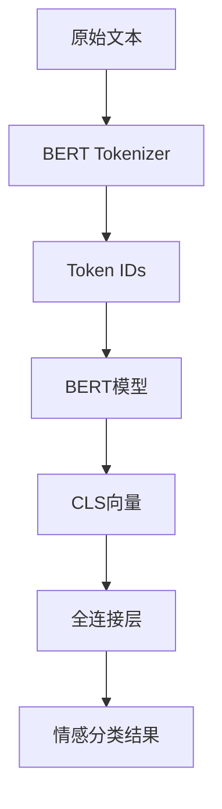

# 中文情感分析(BERT)项目

## 项目概述
基于BERT预训练模型的中文文本情感分析系统，使用PyTorch实现二分类(正面/负面)。

## 详细工作流程
### 1. 数据加载流程


## 核心功能
1. 中文文本情感分类（正面/负面）
2. BERT模型微调训练
3. 模型验证与测试
4. 自定义数据集加载

## 技术架构


## 文件结构
- `MyData.py`: 数据集加载和处理模块
- `net.py`: BERT模型定义
- `train_val.py`: 模型训练和验证脚本
- `data_test.py`: 数据集测试脚本
- `token_test.py`: 分词器测试脚本
- `data/`: 存放数据集
- `model/`: 存放预训练模型
- `params/`: 存放训练好的模型参数

## 环境要求
- Python 3.8+
- PyTorch 1.12+
- Transformers 4.30+

## 快速开始
1. 安装依赖:
```bash
pip install torch transformers datasets
```

## 模型训练流程

1. **初始化设置**
   - 检测并设置训练设备(CPU/GPU)
   - 定义训练轮次(EPOCH=30000)
   - 加载BERT中文分词器

2. **数据预处理**
   - 创建训练集和验证集
   - 使用DataLoader进行批量加载
   - 对文本数据进行编码和填充
   - 将标签转换为张量

3. **模型训练**
   - 初始化BERT模型
   - 定义优化器(AdamW)和损失函数(CrossEntropyLoss)
   - 训练循环:
     - 前向传播计算输出
     - 计算损失
     - 反向传播更新参数
     - 每5个批次输出训练信息(损失和准确率)

4. **模型验证**
   - 在验证集上评估模型
   - 计算验证损失和准确率
   - 保存最佳模型参数

5. **模型保存**
   - 保存最佳验证准确率对应的参数到`params/best_bert.pth`
   - 保存最后一轮训练参数到`params/last_bert.pth`